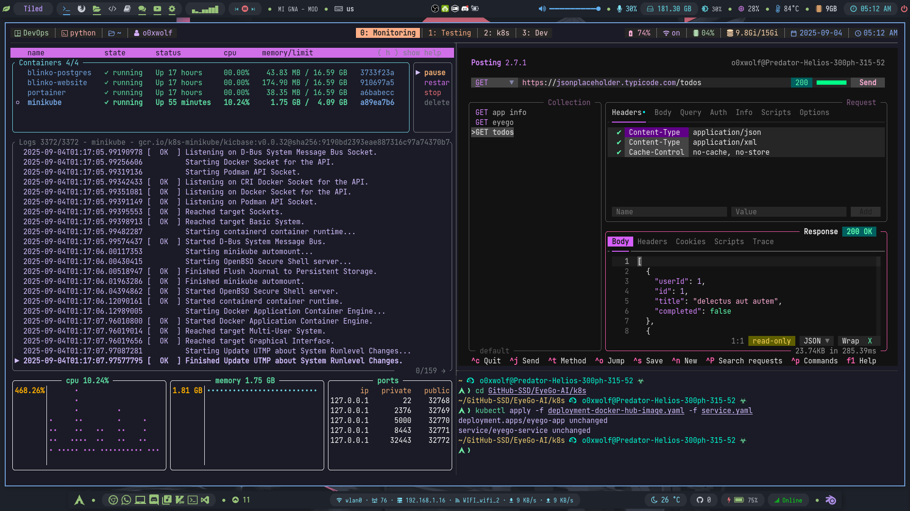

 <h1 align="center"> 🖥️ My Awesome tmux config </h1>
<div align="center">



</div>

## 🚀 Installation

### 1. Install TPM (tmux plugin manager)

```bash
git clone https://github.com/tmux-plugins/tpm ~/.tmux/plugins/tpm
```

### 2. Create tmux configuration directory

```bash
mkdir -p ~/.config/tmux
touch ~/.config/tmux/tmux.conf
```

### 3. Install Catppuccin theme

```bash
mkdir -p ~/.config/tmux/plugins/catppuccin
git clone -b v2.1.3 https://github.com/catppuccin/tmux.git ~/.config/tmux/plugins/catppuccin/tmux
```

### 4. Copy configuration file

Copy the [**`tmux.conf`**](tmux.conf) file to `~/.config/tmux/tmux.conf`

## 🔧 Usage

After installation, start tmux and press `Ctrl+b` + `I` to install plugins.
> or run `~/.tmux/plugins/tpm/bin/install_plugins`

## 📁 File Structure

```
~/.config/tmux/
├── tmux.conf                    # Main configuration file
└── plugins/
    ├── tpm/                     # tmux plugin manager
    └── catppuccin/             # Catppuccin theme
```

## 💡 Tips

If you use a window manager like `bspwm`

- copy [**`bsptmux`**](bsptmux) to user bin
- create a Keybinding shortcut in `sxhkdrc` file
```sxhkdrc
# Open Tmux #
super + shift + t
	bsptmux
```

## 🎨 Features

- **Modern theme** - Catppuccin color scheme
- **Plugin management** - Easy plugin installation and updates
- **Optimized layout** - Enhanced window and pane management
- **Keyboard shortcuts** - Improved key bindings for productivity

## 📝 License

This project is licensed under the terms specified in the [LICENSE](LICENSE) file.

## 🤝 Contributing

Feel free to submit issues and enhancement requests!